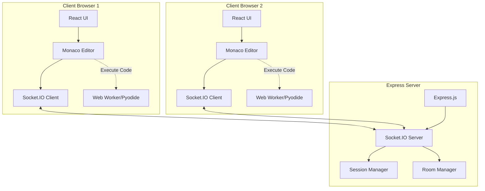
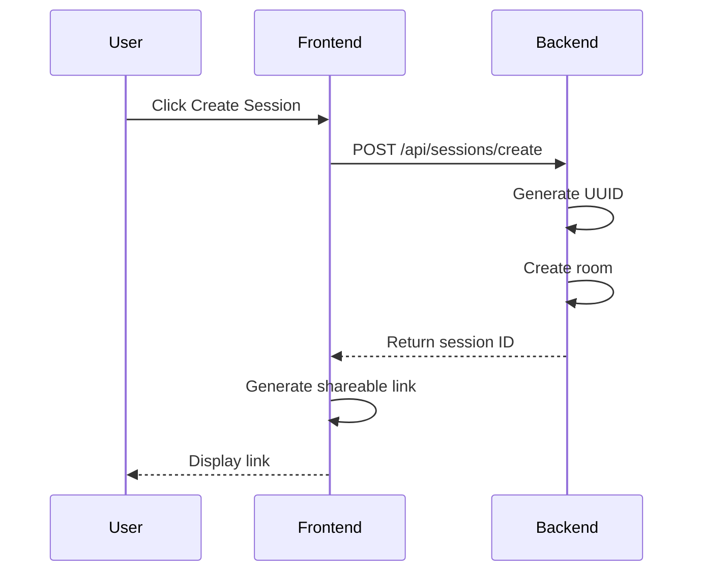
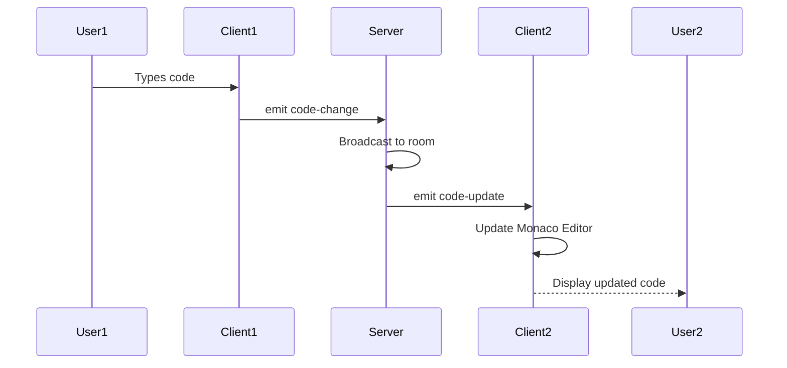
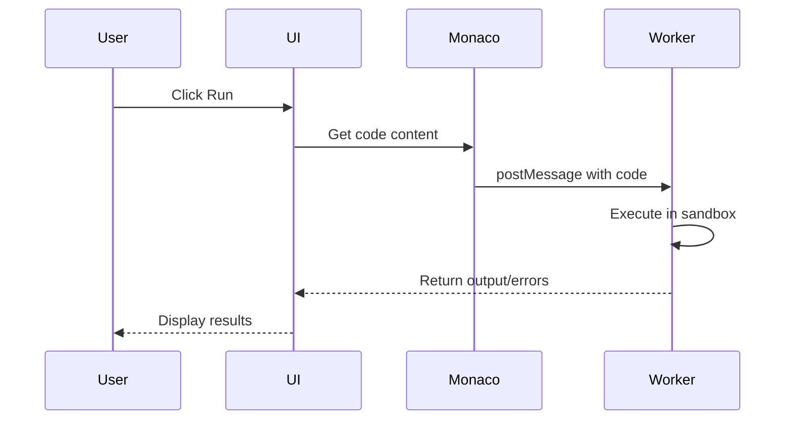

# Online Coding Interview Platform - Architecture

## System Overview

This application enables real-time collaborative coding interviews with support for JavaScript and Python, featuring live code synchronization and browser-based code execution.

## Technology Stack

### Frontend

- **Framework**: React 18 with Vite
- **Code Editor**: Monaco Editor (VS Code's editor)
- **Real-time Communication**: Socket.IO Client
- **Code Execution**:
  - JavaScript: Web Workers
  - Python: Pyodide (Python in WebAssembly)
- **Styling**: CSS Modules / Tailwind CSS

### Backend

- **Runtime**: Node.js
- **Framework**: Express.js
- **Real-time Communication**: Socket.IO
- **Session Management**: In-memory storage (can be extended to Redis)

## Architecture Diagram



## Core Features

### 1. Session Management

- Generate unique session IDs using UUID
- Create shareable links for interview sessions
- Track active sessions and connected users
- Automatic cleanup of inactive sessions

### 2. Real-time Collaboration

- Broadcast code changes to all connected clients
- Synchronize cursor positions (optional enhancement)
- Show connected users count
- Handle user join/leave events

### 3. Code Editor

- Monaco Editor with syntax highlighting
- Language selection (JavaScript/Python)
- Auto-completion and IntelliSense
- Theme support (light/dark)

### 4. Code Execution

- **JavaScript**: Execute in isolated Web Worker
- **Python**: Execute using Pyodide in browser
- Display output, errors, and console logs
- Execution timeout protection

## Data Flow

### Session Creation Flow



### Code Synchronization Flow



### Code Execution Flow



## Project Structure

```
coding-interview-app/
├── backend/
│   ├── src/
│   │   ├── server.js           # Express server setup
│   │   ├── socket/
│   │   │   ├── handlers.js     # Socket.IO event handlers
│   │   │   └── rooms.js        # Room management
│   │   └── utils/
│   │       └── sessionManager.js
│   ├── package.json
│   └── .env
│
├── frontend/
│   ├── src/
│   │   ├── App.jsx
│   │   ├── components/
│   │   │   ├── CodeEditor.jsx
│   │   │   ├── LanguageSelector.jsx
│   │   │   ├── OutputPanel.jsx
│   │   │   ├── SessionCreator.jsx
│   │   │   └── UserIndicator.jsx
│   │   ├── hooks/
│   │   │   └── useSocket.js
│   │   ├── workers/
│   │   │   ├── jsExecutor.worker.js
│   │   │   └── pyExecutor.js
│   │   └── utils/
│   │       └── codeRunner.js
│   ├── package.json
│   └── vite.config.js
│
└── README.md
```

## API Endpoints

### REST API

- `POST /api/sessions/create` - Create new interview session
- `GET /api/sessions/:id` - Get session details
- `GET /api/health` - Health check

### Socket.IO Events

#### Client → Server

- `join-session` - Join an interview session
- `code-change` - Send code updates
- `language-change` - Change programming language
- `disconnect` - User disconnects

#### Server → Client

- `session-joined` - Confirmation of joining
- `code-update` - Receive code updates
- `language-update` - Language changed
- `user-joined` - New user joined
- `user-left` - User left session
- `users-count` - Update connected users count

## Security Considerations

1. **Code Execution Sandbox**

   - Web Workers provide isolated execution context
   - Pyodide runs in WebAssembly sandbox
   - No access to DOM or sensitive APIs
   - Execution timeout limits

2. **Session Security**

   - UUID-based session IDs (hard to guess)
   - Optional: Add password protection
   - Session expiration after inactivity

3. **Rate Limiting**
   - Limit code execution frequency
   - Limit session creation rate
   - WebSocket message rate limiting

## Performance Optimizations

1. **Code Synchronization**

   - Debounce code change events (300ms)
   - Send only deltas for large files
   - Compress messages for large payloads

2. **Editor Performance**

   - Lazy load Monaco Editor
   - Use Web Workers for heavy operations
   - Virtualize output for large results

3. **Backend Optimization**
   - Use Redis for session storage (scalability)
   - Implement connection pooling
   - Add caching layer

## Future Enhancements

1. **Features**

   - Video/audio chat integration
   - Code review and annotation tools
   - Save and export interview sessions
   - Multiple file support
   - Git integration

2. **Languages**

   - Add more language support
   - Server-side execution option
   - Custom test cases

3. **Collaboration**
   - Cursor position synchronization
   - User presence indicators
   - Chat functionality
   - Screen sharing

## Deployment Strategy

### Development

- Frontend: `npm run dev` (Vite dev server)
- Backend: `npm run dev` (nodemon)

### Production

- Frontend: Build static files, deploy to CDN/Vercel
- Backend: Deploy to cloud platform (AWS, Heroku, Railway)
- Use environment variables for configuration
- Enable CORS for cross-origin requests
- Use HTTPS for secure WebSocket connections

## Testing Strategy

1. **Unit Tests**

   - Code execution workers
   - Session management logic
   - Socket event handlers

2. **Integration Tests**

   - Real-time synchronization
   - Multi-user scenarios
   - Session lifecycle

3. **E2E Tests**
   - Complete user flows
   - Cross-browser testing
   - Performance testing

## Monitoring and Logging

- Log all session creation/destruction
- Monitor WebSocket connections
- Track code execution errors
- Performance metrics (latency, throughput)
- Error tracking (Sentry integration)
